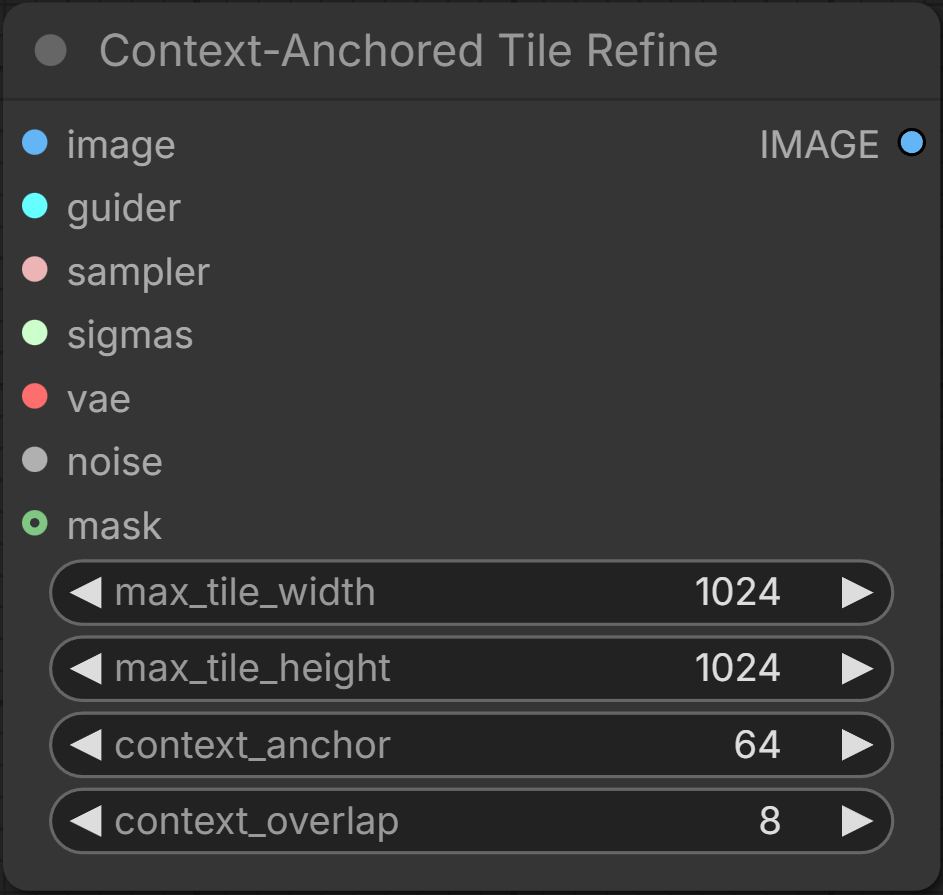

# Context-Anchored Tile Refine

A single ComfyUI node for tiled upscaling and for refining masked areas of large images without processing the whole image. It refines an already-upscaled image tile by tile with no visible seams. Upscale the image however you like first, then feed it in.

## Node inputs

| Input | Type | What it does |
|---|---|---|
| `image` | IMAGE | The image to refine (already upscaled or composited). |
| `guider` | GUIDER | Denoises each tile. |
| `sampler` | SAMPLER | The sampler used for each tile. |
| `sigmas` | SIGMAS | The schedule. Sets denoise strength. |
| `vae` | VAE | Encodes and decodes each tile. |
| `noise` | NOISE | Noise source (e.g. RandomNoise), as in SamplerCustomAdvanced. |
| `max_tile_width` / `max_tile_height` | INT | Largest pixel size the model sees per tile, including the context rings. Set to the largest your model handles well. |
| `context_anchor` | INT | Width of the frozen border each tile sees but never changes. Holds already-refined neighbors, and the area around a mask, steady. Applies on every tile edge. |
| `context_overlap` | INT | Width of the blend band shared with an already-processed neighbor. 0 gives hard seams. Applies only where a tile borders an earlier tile. |
| `seam_mode` | COMBO | Where the handover sits inside that band. `min_error` (default) routes it through pixels where the two tiles already agree. `straight` keeps it a straight line. `warp` makes it meander along a seeded noise field. |
| `warp_amount` / `warp_scale` | INT / FLOAT | Only used by `seam_mode=warp`. How far the handover wanders, and the wavelength of the meander. |
| `mask` | MASK (optional) | Refine only this region. Everything outside it is left untouched. |

`context_anchor` and `context_overlap` default to 32, which is invisible on most scenes. Raise `context_overlap` toward 128 for large smooth gradients such as an open sky, where there is no texture for the seam to hide in. Detailed scenes need less, not more.

## How seams are hidden

Tiles are processed in raster order, so each tile's top and left neighbors are already refined when it is sampled. `context_anchor` gives every tile a frozen border of that finished content to condition against, so tiles continue each other instead of drifting.

`context_overlap` keeps the raw input of the shared band and diffuses it twice, once from each side, each reaching out to its `context_anchor`, then blends the two results together. Both start from the same raw pixels and each saw the other side as context, so they agree and the seam disappears. This happens only where a tile borders a tile that was already processed, never at the image border.

The blend across that band is a directional feather. It holds the seam-adjacent pixels fully on the new tile, then falls off to nothing at the outer edge, reaching zero with zero slope so there is no visible junction against the neighbor. A plain linear ramp does leave one, because the small brightness difference between two independent refinements becomes a bounded gradient that the eye reads as a line.

`seam_mode=min_error` then bends that handover off a straight line, following the Efros-Freeman minimum-error path so it passes through pixels where the two refinements already match. A straight boundary is easy to spot even when it is faint, and a curved one that tracks the image content is not.

The shape of the feather is fixed rather than exposed. Two alternatives were built and compared on a night sky and a close-up face: a narrow ramp landing exactly on the routed path, and a hard cut with no blending at all. All three measured the same, and the hard cut tore at a high-contrast silhouette edge, so only the feather remains.

Open [`docs/tile-simulator.html`](https://blakeem.github.io/ComfyUI-ContextAnchoredTileRefine/tile-simulator.html) in a browser to preview the tile layout for any image size and settings.

You can see how I use it in my [`personal ComfyUI workflow`](Chroma%20+%20z-image%20Hybrid%20workflow.json).

## Masked refine

With a `mask`, the node crops to the masked region plus a `context_anchor` border, refines only that region against the frozen surrounding pixels, and blends it back with a 1px anti-aliased edge. The rest of the image is left byte-for-byte untouched. Feed an inverted mask on a second pass to refine, for example, the background and the character separately with different settings.

## Guider and ControlNet

The `guider` input lets you use Perp-Neg Guider (or any guider). The tradeoff: the guider's conditioning covers the whole image and is not re-cropped per tile, so ControlNet is not supported.

## License

[GPLv3](LICENSE)
