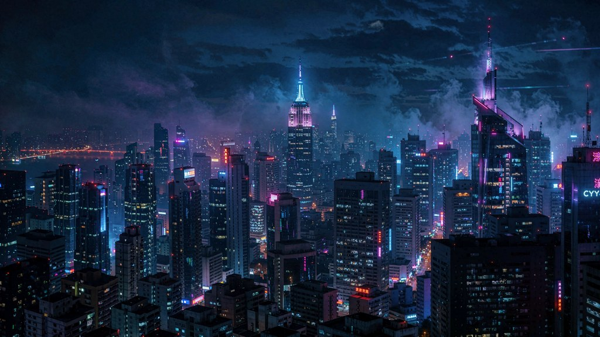
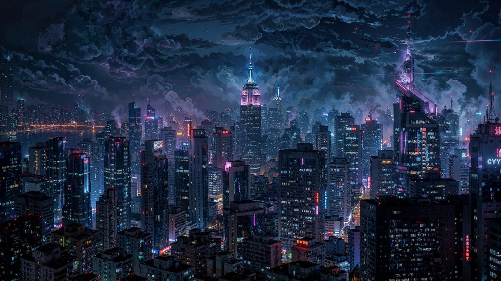
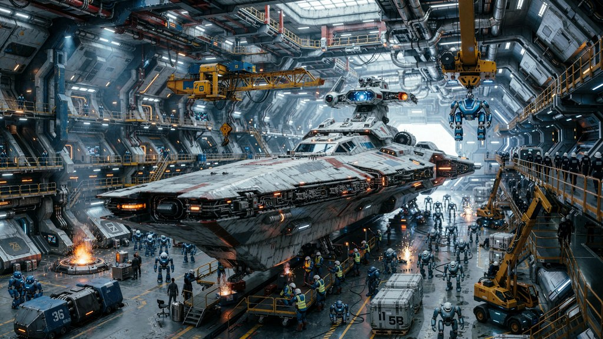
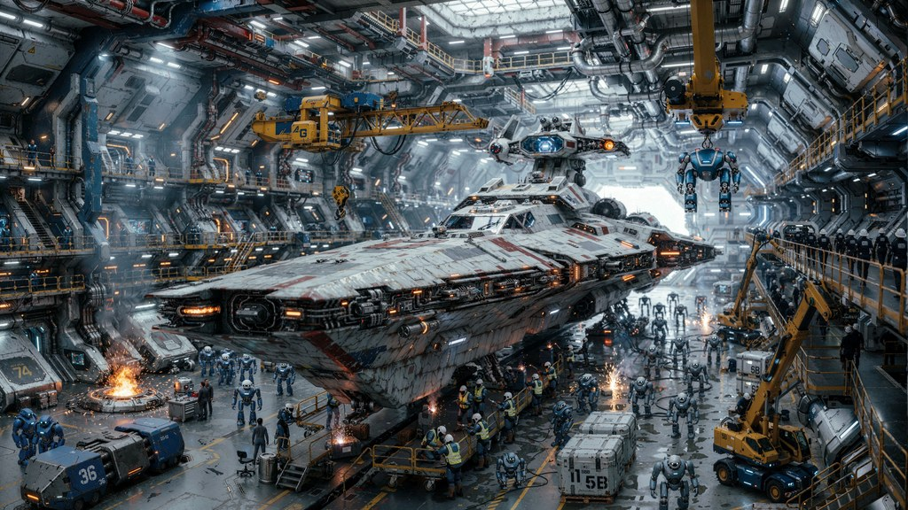
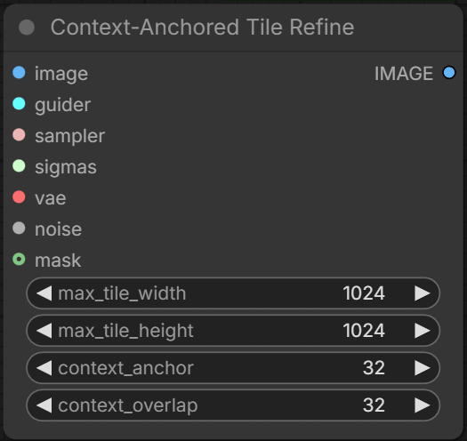
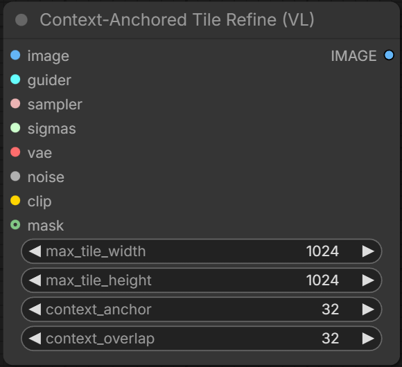
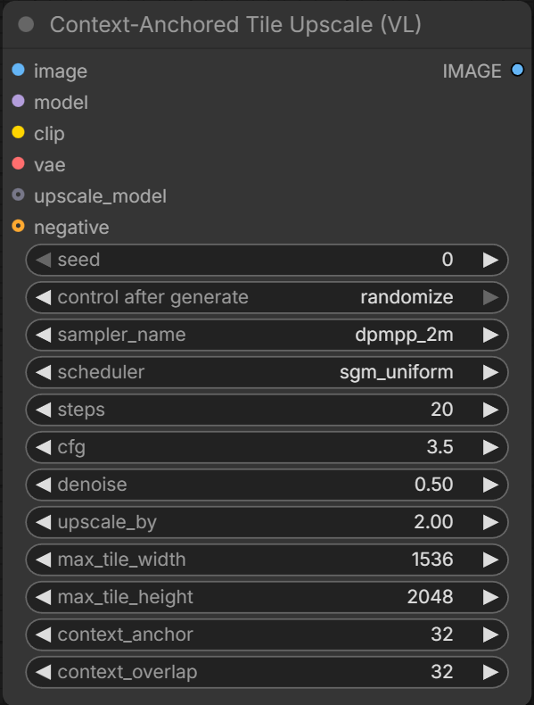

# Context-Anchored Tile Refine

ComfyUI nodes for tiled refining and upscaling. An already upscaled image is refined a tile at a time with no visible seams. On the VL nodes, a global prompt is replaced by vision conditioning.

Sample results from Krea 2 and the Tile Upscale (VL) node. Each image was upscaled in two passes: 4x at denoise 0.5 (6 tiles), then 2x at denoise 0.35 (30 tiles). These are the first two images made with this method and they are not cherry picked. Click to view the full-sized image.

<table>
<tr>
<td align="center"><a href="samples/cyberpunk-city.webp"></a><br><sub>Original, 1024x576</sub></td>
<td align="center"><a href="samples/cyberpunk-city-4k.webp"></a><br><sub>4x, denoise 0.5, 6 tiles, 4096x2304</sub></td>
<td align="center"><a href="samples/cyberpunk-city-8k.webp"></a><br><sub>then 2x, denoise 0.35, 30 tiles, 8192x4608</sub></td>
</tr>
<tr>
<td colspan="3"><sub><b>Prompt:</b> Cyberpunk cityscape at night</sub></td>
</tr>
<tr>
<td align="center"><a href="samples/orbital-shipyard-hangar.webp"></a><br><sub>Original, 1024x576</sub></td>
<td align="center"><a href="samples/orbital-shipyard-hangar-4k.webp"></a><br><sub>4x, denoise 0.5, 6 tiles, 4096x2304</sub></td>
<td align="center"><a href="samples/orbital-shipyard-hangar-8k.webp"></a><br><sub>then 2x, denoise 0.35, 30 tiles, 8192x4608</sub></td>
</tr>
<tr>
<td colspan="3"><sub><b>Prompt:</b> Interior of a kilometers-long orbital shipyard hangar, a massive capital starship under construction surrounded by scaffold gantries, crane arms, welding sparks, and swarms of worker mechs, cargo trams and crew walkways at every level, the hangar ceiling dense with lights, pipes, and docking cranes, hull plating covered in panel lines and markings, everything in sharp focus</sub></td>
</tr>
</table>

## Node Selection

| Node | Use when |
|---|---|
| [Tile Refine](#tile-refine) | Most diffusion models. You upscale first and wire the sampling nodes yourself. |
| [Tile Refine (VL)](#tile-refine-vl) | Krea 2. The same wiring plus `clip`, and no positive prompt is needed. |
| [Tile Upscale (VL)](#tile-upscale-vl) | Krea 2. Upscale and refine in one node. |

The VL nodes were built for and tested with Krea 2. Other Qwen3-VL based models, including Krea 2 Turbo, are untested.

## Node Inputs and Parameters

| Input | Nodes | What it does |
|---|---|---|
| [`max_tile_width` / `max_tile_height`](#dynamic-tile-layout) | all | Largest pixel size the model sees per tile, context rings included. Set to the largest size your model handles well. |
| [`context_anchor`](#context-rings) | all | Width of the context ring each tile conditions on. The ring holds neighboring tiles together and a masked region to its surroundings. |
| [`context_overlap`](#context-rings) | all | Width of the band neighboring tiles share. 0 gives hard seams. Smooth gradients need more and detailed scenes need less. |
| [`anchor_source`](#anchor-source) | VL | What the context ring shows: the unmodified input for maximum fidelity, or the in-progress result so that flawed content can be repaired. |
| [`vlm_method`](#conditioning-on-the-vl-nodes) | VL | What the model is told about each tile. Adding captions repairs flawed content during upscale. |
| [`mask`](#masked-refine) | Refine, Refine (VL) | Refines only the masked region and leaves everything outside it untouched. |
| `clip` | VL | The vision-language encoder that builds all tile conditioning. Tested only with Qwen3-VL as used by Krea 2. |

Preview any layout with the [tile simulator](https://blakeem.github.io/ComfyUI-ContextAnchoredTileRefine/tile-simulator.html).

**Jump to:** [Installation](#installation) | [The nodes](#the-nodes) | [Features](#features) | [Example workflows](#example-workflows)

## Installation

Search for "Context-Anchored Tile Refine" in ComfyUI Manager, or clone into your `custom_nodes` folder:

```
git clone https://github.com/blakeem/ComfyUI-ContextAnchoredTileRefine
```

## The nodes

### Tile Refine



The base node works with most diffusion models. Upscale the image first and feed it in. Since the image is already upscaled, a mask is supported.

### Tile Refine (VL)



The VL node adds vision conditioning to the base node and is built for Krea 2. Inputs are the base node's plus `clip` and the two VL selects. No positive prompt is needed, since each tile's conditioning is built from the image itself (see [Conditioning on the VL nodes](#conditioning-on-the-vl-nodes)). The guider's positive prompt is ignored and its negative still applies. Encoders without a vision path (SD/SDXL CLIP, T5, plain Qwen3) are rejected with a clear error. A `mask` is supported and keeps the global view (see [Masked refine](#masked-refine)).

### Tile Upscale (VL)



Tile Upscale (VL) runs the whole flow in one node. The image is upscaled first, through the optional `upscale_model` when connected, and a single lanczos pass brings it to `input size x upscale_by`. It then runs the same VL tile refine as Tile Refine (VL).

## Features

### Tiling geometry

#### Dynamic tile layout

*Nodes: [Tile Refine](#tile-refine) | [Tile Refine (VL)](#tile-refine-vl) | [Tile Upscale (VL)](#tile-upscale-vl)*

The grid is solved from the image size and `max_tile_width` / `max_tile_height`. Every crop is aligned to an 8 pixel boundary. Tiles are extracted, sampled, and pasted back at their native pixel size, so no quality is lost to resizing.

#### Context rings

*Nodes: [Tile Refine](#tile-refine) | [Tile Refine (VL)](#tile-refine-vl) | [Tile Upscale (VL)](#tile-upscale-vl)*

Each tile is sampled with two extra rings that are cropped away after. `context_overlap` is the band shared with the neighboring tiles. `context_anchor` is pure context beyond that. The tile conditions on the anchor ring, so it continues its neighbors instead of drifting away from them. On the VL nodes, [`anchor_source`](#anchor-source) picks what the ring shows.

### Seams on the base node

The base node refines tiles one after another in raster order, so a tile's top and left neighbors are finished before it is sampled. Seams are hidden by conditioning first and then a narrow blend.

#### Anchor conditioning

*Nodes: [Tile Refine](#tile-refine)*

The anchor ring shows each tile its already refined neighbors and holds that content frozen. This is the main seam mechanism, and the blending below only smooths the small differences left in the band.

#### Directional feather

*Nodes: [Tile Refine](#tile-refine)*

Both tiles diffuse the shared band from the same raw pixels and the results are cross dissolved. The first 10 percent of the band stays with the new tile, then a squared ramp fades it to zero so that the two tiles connect at zero slope. A linear ramp meets the neighbor at an angle and appears as a visible line.

#### Minimum error boundary cut

*Nodes: [Tile Refine](#tile-refine)*

Dynamic programming finds the path through the overlap band where the two refinements already agree, from Efros and Freeman, *Image Quilting for Texture Synthesis and Transfer* (SIGGRAPH 2001). The paper makes a hard cut on that path. With our method, the feather's midpoint bends along it, so the blend follows image content rather than a straight line.

#### Brightness and color match

*Nodes: [Tile Refine](#tile-refine)*

Tiles diffused separately land at slightly different brightness and color levels. The fix is a variant of gain compensation from Brown and Lowe, *Automatic Panoramic Image Stitching* (IJCV 2007): additive, per channel, and sequential. The shared band is the only place both tiles refined the same raw pixels, so the median of the difference there comes from the color shift and not from the content. Subtracting that median puts each tile on its neighbor's level. It runs only at tile seams, not at mask edges.

### Seams on the VL nodes

The VL nodes diffuse every tile together, so there is nothing to correct afterwards.

#### Synchronized latent tiling

*Nodes: [Tile Refine (VL)](#tile-refine-vl) | [Tile Upscale (VL)](#tile-upscale-vl)*

The entire image is within one shared canvas latent and every tile is diffused one step at a time. Between steps the tiles are consolidated back into that canvas, with the overlap bands cross dissolved by the same directional feather in latent space. This requires no boundary cut or color match.

MultiDiffusion (Bar-Tal et al., ICML 2023) and Mixture of Diffusers (Jiménez, 2023) also process tiles at every step. Those methods overlap tiles and use an average of the two predictions, so where the tiles disagree the result is a soft image. With our method, the tiles are joined together at the boundary so that the tile body is direct model output. Only the thin band is predicted twice, and the feather blends the seam toward the later tile. The anchor ring is context that the tiles use to be aware of their surroundings. Those methods fuse inside one sampler pass over the entire canvas. With ours, each tile runs its own sampler and all the tiles are held to the same step.

#### Anchor source

*Nodes: [Tile Refine (VL)](#tile-refine-vl) | [Tile Upscale (VL)](#tile-upscale-vl)*

`source image` (default) shows the ring the unmodified input. This keeps placement, style, and objects locked to the input, including its flaws. The `live canvas` shows the ring the neighbors' in-progress result instead, so the refine can repair flawed content. Expect more invention and slightly brighter output.

#### Supported samplers

*Nodes: [Tile Refine (VL)](#tile-refine-vl) | [Tile Upscale (VL)](#tile-upscale-vl)*

The VL path steps every tile against one schedule, so it must time each sampler's model evaluations. The supported samplers are `euler`, `heun`, `dpm_2`, `dpmpp_2m`, `dpmpp_2m_sde` (all variants), `exp_heun_2_x0`, and `exp_heun_2_x0_sde`. Anything else is rejected before sampling starts. `dpm_fast`, `dpm_adaptive`, and `uni_pc` run their own schedule and cannot be supported. The base node accepts every sampler.

### Conditioning on the VL nodes

A global prompt describes the whole image while each tile holds only part of it. The diffusion model then recreates prompt objects inside tiles that should not contain them. The VL nodes replace the prompt with conditioning that is true for each tile, built by the same Qwen3-VL encoder wired to `clip`. Two operations are involved: encoding the whole image into vision tokens (shared by all tiles), and writing a caption from one tile's crop (local to that tile). `vlm_method` picks which one fills each tile's conditioning.

#### Vision tokens

*Nodes: [Tile Refine (VL)](#tile-refine-vl) | [Tile Upscale (VL)](#tile-upscale-vl)*

The whole image is encoded once into a grid of vision tokens that are loosely aware of their position and carry their area's tone, palette, and objects. Each tile is assigned conditioning for that slice of the grid. No global text prompt is used, so nothing phantom is introduced. The slicing selects tokens by region of interest, the analogue of RoIAlign (He et al., *Mask R-CNN*, ICCV 2017) in conditioning space. This is the fastest method, since one encode is shared by every tile.

#### Captions

*Nodes: [Tile Refine (VL)](#tile-refine-vl) | [Tile Upscale (VL)](#tile-upscale-vl)*

The same VL model writes a short description of each tile from that tile's crop alone, and the description is used as that tile's prompt. Naming content removes ambiguity, so artifacts and mushy areas in the source are repaired toward the named thing. The cost scales with tile count and no whole image encode is built.

#### Vision tokens and captions

*Nodes: [Tile Refine (VL)](#tile-refine-vl) | [Tile Upscale (VL)](#tile-upscale-vl)*

The default method combines the tile's vision slice and its own caption in a single conditioning. The shared encode keeps the tile faithful to the picture and coherent with its neighbors. The caption names what is there and adds detail. The cost is one shared encode plus one caption per tile.

### Regions, batches, and control

#### Masked refine

*Nodes: [Tile Refine](#tile-refine) | [Tile Refine (VL)](#tile-refine-vl)*

With a `mask`, the node crops to the masked region plus a `context_anchor` border, refines only that region against the frozen surrounding pixels, and composites it back with a 1px anti-aliased edge. The rest of the image is untouched. On the VL node the whole image is still encoded once and the region's tiles slice their true place in that encode, so the region is refined aware of everything around it. Feed an inverted mask on a second pass to refine the background and the character separately with different settings.

#### Batches

*Nodes: [Tile Refine](#tile-refine) | [Tile Refine (VL)](#tile-refine-vl) | [Tile Upscale (VL)](#tile-upscale-vl)*

Each picture in a batch is refined on its own, so peak VRAM does not scale with batch size. Every picture gets its own conditioning, its own seam placement and color match on the base node, and its own synchronized run on the VL nodes.

#### Guider and ControlNet

*Nodes: [Tile Refine](#tile-refine) | [Tile Refine (VL)](#tile-refine-vl) | [Tile Upscale (VL)](#tile-upscale-vl)*

The `guider` input takes any guider, including NAG for models without negative prompt support. ControlNet works on the base node. The control hint is cropped to each tile, so depth, canny, or pose guidance lands on the right pixels. Build the hint at the same size as the input image. The VL nodes ignore ControlNet and log a warning, since every tile's positive is replaced by vision conditioning and there is nothing for a hint to attach to. GLIGEN, area masks, and reference latents pass through unchanged.

## Example workflows

- [Krea 2 upscale workflow](Krea%202.json)
- [Krea 2 8K upscale workflow](Krea%202%208k%20upscale.json) (the two-pass 4x then 2x chain the sample images above were made with)
- [Krea 2 refine workflow](Krea%202%20(refine).json)
- [Chroma + Z-Image hybrid workflow](Chroma%20+%20z-image%20Hybrid%20workflow.json)

## License

[GPLv3](LICENSE)
