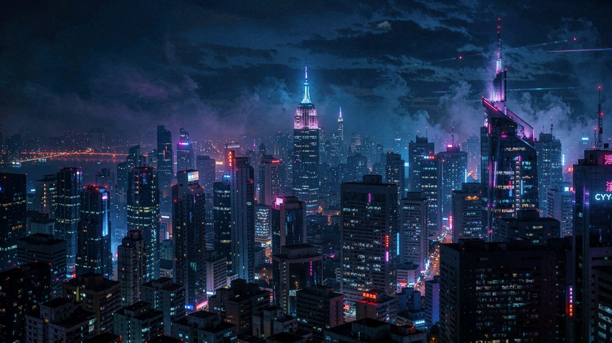
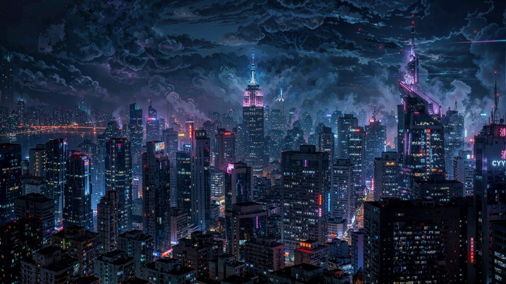
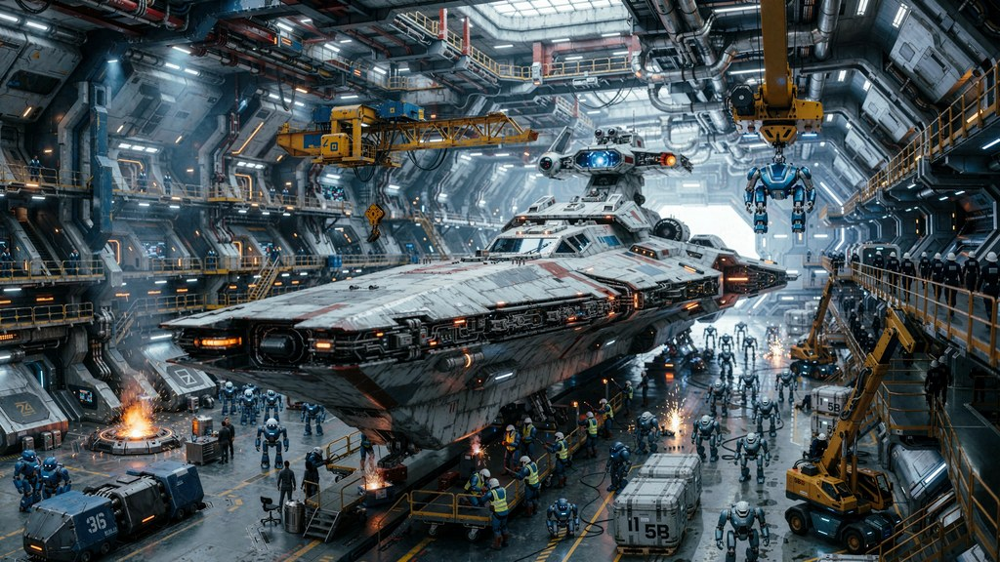
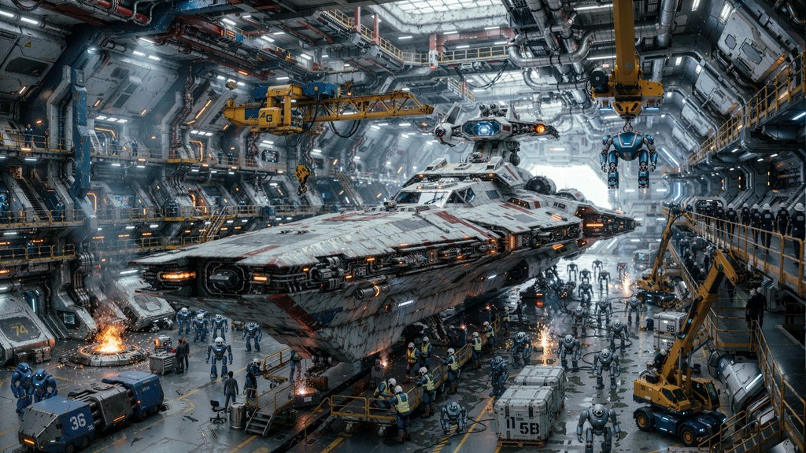
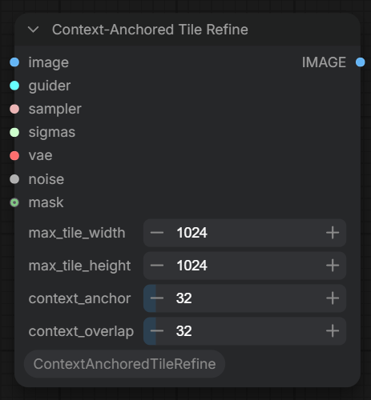
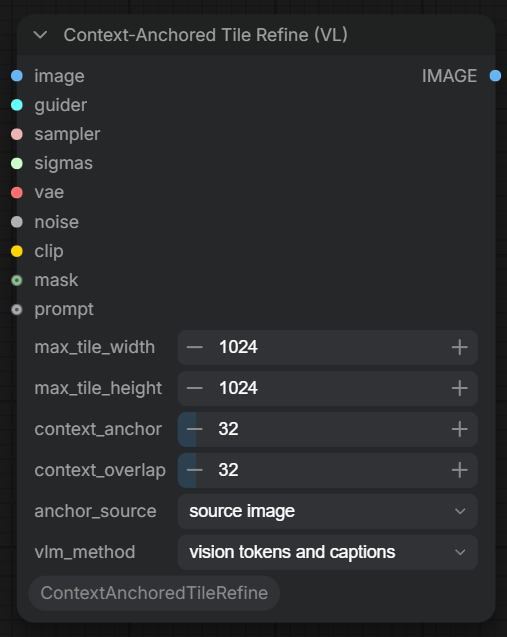
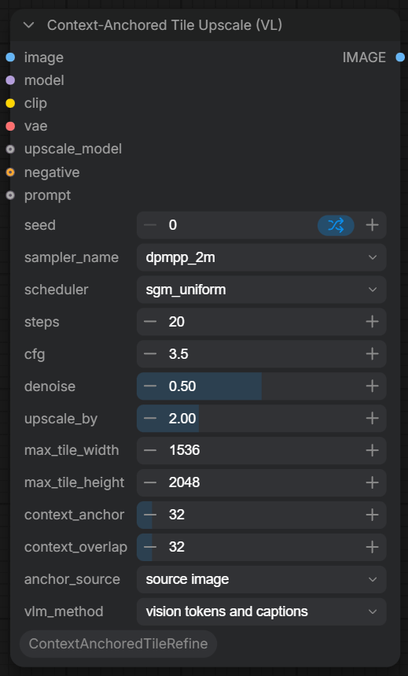

# Context-Anchored Tile Refine

ComfyUI nodes for tiled refining and upscaling. An already upscaled image is refined a tile at a time with no visible seams. On the VL nodes, a global prompt is replaced by vision conditioning.

Sample results from Krea 2 and the Tile Upscale (VL) node. Each image was upscaled in two passes, 4x at denoise 0.5 (6 tiles), then 2x at denoise 0.35 (30 tiles). These are the first two images made with this method and they are not cherry picked. Click to view the full-sized image.

<table>
<tr>
<td align="center"><a href="samples/cyberpunk-city.webp"></a><br><sub>Original, 1024x576</sub></td>
<td align="center"><a href="samples/cyberpunk-city-4k.webp"></a><br><sub>4x, denoise 0.5, 6 tiles, 4096x2304</sub></td>
<td align="center"><a href="samples/cyberpunk-city-8k.webp"></a><br><sub>then 2x, denoise 0.35, 30 tiles, 8192x4608</sub></td>
</tr>
<tr>
<td colspan="3"><sub><b>Prompt:</b> Cyberpunk cityscape at night</sub></td>
</tr>
<tr>
<td align="center"><a href="samples/orbital-shipyard-hangar.webp"></a><br><sub>Original, 1024x576</sub></td>
<td align="center"><a href="samples/orbital-shipyard-hangar-4k.webp"></a><br><sub>4x, denoise 0.5, 6 tiles, 4096x2304</sub></td>
<td align="center"><a href="samples/orbital-shipyard-hangar-8k.webp"></a><br><sub>then 2x, denoise 0.35, 30 tiles, 8192x4608</sub></td>
</tr>
<tr>
<td colspan="3"><sub><b>Prompt:</b> Interior of a kilometers-long orbital shipyard hangar, a massive capital starship under construction surrounded by scaffold gantries, crane arms, welding sparks, and swarms of worker mechs, cargo trams and crew walkways at every level, the hangar ceiling dense with lights, pipes, and docking cranes, hull plating covered in panel lines and markings, everything in sharp focus</sub></td>
</tr>
</table>

## Node Selection

| Node | Use when |
|---|---|
| [Tile Refine](#tile-refine) | Most diffusion models. You upscale first and wire the sampling nodes yourself. |
| [Tile Refine (VL)](#tile-refine-vl) | Krea 2. The same wiring plus `clip` and `prompt`. No positive conditioning is needed. |
| [Tile Upscale (VL)](#tile-upscale-vl) | Krea 2. Upscale and refine in one node. |

The VL nodes were built for and tested with Krea 2. Other Qwen3-VL based models, including Krea 2 Turbo, are untested.

## Node Inputs and Parameters

| Input | Nodes | What it does |
|---|---|---|
| [`max_tile_width` / `max_tile_height`](#dynamic-tile-layout) | all | Largest pixel size the model sees per tile, context rings included. Set to the largest size your model handles well. |
| [`context_anchor`](#context-rings) | all | Width of the context ring each tile conditions on. The ring holds neighboring tiles together and a masked region to its surroundings. |
| [`context_overlap`](#context-rings) | all | Width of the band neighboring tiles share. 0 gives hard seams. Smooth gradients need more and detailed scenes need less. |
| [`anchor_source`](#anchor-source) | VL | The context ring shows either the unmodified input for maximum fidelity, or the in-progress result so that flawed content can be repaired. |
| [`vlm_method`](#conditioning-on-the-vl-nodes) | VL | What the model is told about each tile. Adding captions repairs flawed content during upscale. |
| [`prompt`](#tile-tags) | VL | The prompt the image was made from. The VL model reads it to name each tile's contents, and the diffusion model never reads it. |
| [`mask`](#masked-refine) | Refine, Refine (VL) | Refines only the masked region and leaves everything outside it untouched. |
| `clip` | VL | The vision-language encoder that builds all tile conditioning. Tested only with Qwen3-VL as used by Krea 2. |

Preview any layout with the [tile simulator](https://blakeem.github.io/ComfyUI-ContextAnchoredTileRefine/tile-simulator.html).

**Jump to:** [Installation](#installation) | [The nodes](#the-nodes) | [Features](#features) | [Example workflows](#example-workflows)

## Installation

Search for "Context-Anchored Tile Refine" in ComfyUI Manager, or clone into your `custom_nodes` folder:

```
git clone https://github.com/blakeem/ComfyUI-ContextAnchoredTileRefine
```

A clone also needs the one Python dependency, [logit-classifier](https://pypi.org/project/logit-classifier/). ComfyUI Manager installs it for you. After a clone, run this in ComfyUI's Python environment from the node's folder:

```
pip install -r requirements.txt
```

## The nodes

### Tile Refine



The base node works with most diffusion models. Upscale the image first and feed it in. Since the image is already upscaled, a mask is supported.

### Tile Refine (VL)



The VL node adds vision conditioning to the base node and is built for Krea 2. Inputs are the base node's plus `clip`, the two VL selects and `prompt`. No positive prompt is needed, since each tile's conditioning is built from the image itself (see [Conditioning on the VL nodes](#conditioning-on-the-vl-nodes)). The guider's positive prompt is ignored and its negative still applies. `prompt` takes the prompt the image was made from. Connect the positive prompt's text to it so that each tile can confirm the things the prompt names (see [Tile tags](#tile-tags)). Encoders without a vision path (SD/SDXL CLIP, T5, plain Qwen3) are rejected with a clear error. A `mask` is supported and keeps the global view (see [Masked refine](#masked-refine)).

### Tile Upscale (VL)



Tile Upscale (VL) runs the whole flow in one node. The image is upscaled first, through the optional `upscale_model` when connected, and a single lanczos pass brings it to `input size x upscale_by`. It then runs the same VL tile refine as Tile Refine (VL).

## Features

### Tiling geometry

#### Dynamic tile layout

*Nodes: [Tile Refine](#tile-refine) | [Tile Refine (VL)](#tile-refine-vl) | [Tile Upscale (VL)](#tile-upscale-vl)*

The grid is solved from the image size and `max_tile_width` / `max_tile_height`. Every crop is aligned to an 8 pixel boundary. Tiles are extracted, sampled, and pasted back at their native pixel size, so no quality is lost to resizing.

#### Context rings

*Nodes: [Tile Refine](#tile-refine) | [Tile Refine (VL)](#tile-refine-vl) | [Tile Upscale (VL)](#tile-upscale-vl)*

Each tile is sampled with two extra rings that are cropped away after. `context_overlap` is the band shared with the neighboring tiles. `context_anchor` is pure context beyond that. The tile conditions on the anchor ring, so it continues its neighbors instead of drifting away from them. On the VL nodes, [`anchor_source`](#anchor-source) picks what the ring shows.

### Seams on the base node

The base node refines tiles one after another in raster order, so a tile's top and left neighbors are finished before it is sampled. Seams are hidden by conditioning first and then a narrow blend.

#### Anchor conditioning

*Nodes: [Tile Refine](#tile-refine)*

The anchor ring shows each tile its already refined neighbors and holds that content frozen. This is the main seam mechanism, and the blending below only smooths the small differences left in the band.

#### Directional feather

*Nodes: [Tile Refine](#tile-refine)*

Both tiles diffuse the shared band from the same raw pixels and the results are cross dissolved. The first 10 percent of the band stays with the new tile, then a squared ramp fades it to zero so that the two tiles connect at zero slope. A linear ramp meets the neighbor at an angle and appears as a visible line.

#### Minimum error boundary cut

*Nodes: [Tile Refine](#tile-refine)*

Dynamic programming finds the path through the overlap band where the two refinements already agree, from Efros and Freeman, *Image Quilting for Texture Synthesis and Transfer* (SIGGRAPH 2001). The paper makes a hard cut on that path. With our method, the feather's midpoint bends along it, so the blend follows image content rather than a straight line.

#### Brightness and color match

*Nodes: [Tile Refine](#tile-refine)*

Tiles diffused separately land at slightly different brightness and color levels. The fix is an additive, per channel, and sequential variant of gain compensation from Brown and Lowe, *Automatic Panoramic Image Stitching* (IJCV 2007). The shared band is the only place both tiles refined the same raw pixels, so the median of the difference there comes from the color shift and not from the content. Subtracting that median puts each tile on its neighbor's level. It runs only at tile seams, not at mask edges.

### Seams on the VL nodes

The VL nodes diffuse every tile together, so there is nothing to correct afterwards.

#### Synchronized latent tiling

*Nodes: [Tile Refine (VL)](#tile-refine-vl) | [Tile Upscale (VL)](#tile-upscale-vl)*

The entire image is within one shared canvas latent and every tile is diffused one step at a time. Between steps the tiles are consolidated back into that canvas, with the overlap bands cross dissolved by the same directional feather in latent space. This requires no boundary cut or color match.

MultiDiffusion (Bar-Tal et al., ICML 2023) and Mixture of Diffusers (Jiménez, 2023) also process tiles at every step. Those methods overlap tiles and use an average of the two predictions, so where the tiles disagree the result is a soft image. With our method, the tiles are joined together at the boundary so that the tile body is direct model output. Only the thin band is predicted twice, and the feather blends the seam toward the later tile. The anchor ring is context that the tiles use to be aware of their surroundings. Those methods fuse inside one sampler pass over the entire canvas. With ours, each tile runs its own sampler and all the tiles are held to the same step.

#### Anchor source

*Nodes: [Tile Refine (VL)](#tile-refine-vl) | [Tile Upscale (VL)](#tile-upscale-vl)*

`source image` (default) shows the ring the unmodified input. This keeps placement, style, and objects locked to the input, including its flaws. The `live canvas` shows the ring the neighbors' in-progress result instead, so the refine can repair flawed content. Expect more invention and slightly brighter output.

#### Supported samplers

*Nodes: [Tile Refine (VL)](#tile-refine-vl) | [Tile Upscale (VL)](#tile-upscale-vl)*

The VL path steps every tile against one schedule, so it must time each sampler's model evaluations. The supported samplers are `euler`, `heun`, `dpm_2`, `dpmpp_2m`, `dpmpp_2m_sde` (all variants), `exp_heun_2_x0`, and `exp_heun_2_x0_sde`. Anything else is rejected before sampling starts. `dpm_fast`, `dpm_adaptive`, and `uni_pc` run their own schedule and cannot be supported. The base node accepts every sampler.

### Conditioning on the VL nodes

A global prompt describes the entire image while each tile holds only part of it. The diffusion model then recreates prompt objects inside tiles that should not contain them. The VL nodes replace the prompt with conditioning that is true for each tile, built by the same Qwen3-VL encoder wired to `clip`. Two operations are involved. One encodes the image into vision tokens. The other writes a caption from the tile's own crop. `vlm_method` picks which one fills each tile's conditioning. The `[vision]` table in `settings.toml` sets how much of the image each operation reads (see [Vision settings](#vision-settings)).

#### Vision tokens

*Nodes: [Tile Refine (VL)](#tile-refine-vl) | [Tile Upscale (VL)](#tile-upscale-vl)*

Each tile is assigned vision tokens from two encodes of the image. The first encode is the tile's own crop, sampled small, so its tokens hold the tile to what it contains. The second encode is the entire image, and the tile is assigned its own slice of that grid, the tile plus its context rings, so those tokens carry the tile's scale and its place in the image. The tokens are loosely aware of their position and carry their area's tone, palette, and objects. The crop tokens keep an empty tile from growing a copy of an object from elsewhere in the image, and the canvas tokens keep a person or a building at the right scale. No global text prompt is used, so nothing phantom is introduced. The slicing selects tokens by region of interest, the analogue of RoIAlign (He et al., *Mask R-CNN*, ICCV 2017) in conditioning space. This is the fastest method, since one small encode per tile costs far less than one caption.

#### Captions

*Nodes: [Tile Refine (VL)](#tile-refine-vl) | [Tile Upscale (VL)](#tile-upscale-vl)*

Each tile's text is used alone as that tile's prompt. The default preset writes the text as [tile tags](#tile-tags). A caption preset has the same VL model write a short description of each tile from that tile's crop alone (see [Caption presets](#caption-presets)). Naming content removes ambiguity, so artifacts and mushy areas in the source are repaired toward the named thing. The cost scales with tile count and no vision encode is built. Tile texts are stored for the session, keyed by the crop and the preset, so a run at a new seed skips the text pass while the same CLIP stays loaded.

#### Vision tokens and captions

*Nodes: [Tile Refine (VL)](#tile-refine-vl) | [Tile Upscale (VL)](#tile-upscale-vl)*

The default method combines the tile's vision tokens and its own text in a single conditioning. The vision tokens keep the tile faithful to the picture and at the right scale. The text names what is there and adds detail. The cost is one small encode plus one text pass per tile.

#### Tile tags

*Nodes: [Tile Refine (VL)](#tile-refine-vl) | [Tile Upscale (VL)](#tile-upscale-vl)*

The default preset writes each tile's text as tags with their positions, such as `red car bottom-left`. The VL model lists the things it sees in the tile. When `prompt` is connected, the VL model also lists the physical things the prompt names, once per image, and every tile checks them. Each candidate is then scored with a true or false statement on the tile, and only the confirmed tags are kept. A tag from the prompt that the tile's own list lacks needs a near certain score. Six strips of the tile, three rows and three columns, give each tag its position, and a tag that no strip holds is dropped. The scoring reads the VL model's answer probabilities through [logit-classifier](https://pypi.org/project/logit-classifier/). A long prompt adds one pass per image and never lengthens a tile's pass. The thresholds live in `settings.toml`.

#### Vision settings

*Nodes: [Tile Refine (VL)](#tile-refine-vl) | [Tile Upscale (VL)](#tile-upscale-vl)*

The `[vision]` table at the top of `settings.toml` sets how each tile's conditioning samples the image. It applies to every `vlm_method` option and is read on every run. `canvas_tokens` is the number of vision tokens each tile takes from the encode of the entire image. The image is sampled at the size where a tile's share of it holds that many tokens, up to 2 megapixels, so a tile gets the same count on a large image as on a small one. `crop_tokens` is the number of tokens from the encode of the tile's own crop. Too few lets an object from elsewhere in the image appear in an empty tile, and too many redraw the tile's own subject. Set either count to 0 to turn that encode off. `caption_megapixels` is how much of the tile the VL model reads when it writes a caption, and 0 reads the picture's own size up to 2 megapixels. One vision token covers 32 x 32 pixels of the picture the encoder reads, so 0.1 megapixels is about 98 tokens and 1 megapixel is about 977. The defaults of 165 canvas tokens and 110 crop tokens were settled on an 8K image with 24 tiles.

#### Caption presets

*Nodes: [Tile Refine (VL)](#tile-refine-vl) | [Tile Upscale (VL)](#tile-upscale-vl)*

The questions behind both text methods live in `settings.toml` in the node's folder. Each `[presets.<label>]` block there adds one option per text method to `vlm_method`. The first block is the default, and its options carry no label. Every other block's options carry its label in parentheses. One preset ships, `tags`, which writes [tile tags](#tile-tags) and one style caption for the entire image. `settings.user.example.toml` carries more presets that write captions instead, such as `prompted`, `standard` and `artwork`. Copy a block from it into your own `settings.user.toml` to use one. The header of each file documents every key.

In a caption preset, `tile_caption_instruction` is what the VL model is asked about each tile. In every preset, `global_style_instruction` is asked about the entire image once per picture, and the answer is placed on top of every tile's text so that all tiles follow one style description. Set it to `""` to skip the style caption.

An instruction may hold `{PROMPT}`. The VL nodes and the Captions node write their `prompt` input in its place before the VL model reads the instruction. The diffusion model still reads the tile text and never the prompt. A preset without `{PROMPT}` ignores the `prompt` input. A caption preset with it stops the run with an error when `prompt` is not connected or is empty. The `tags` preset skips its prompt question when `prompt` is empty.

Copy `settings.toml` to `settings.user.toml` and edit the copy. The nodes read `settings.user.toml` whenever it exists, and a node update never replaces it. Editing a preset's wording applies on the next run, and the nodes re-run when the file changes even when no widget changed. Adding or renaming a preset changes the selector, so it needs a ComfyUI restart.

Five test nodes ship for tuning tiles and presets. They are not production nodes. `Tile Test: Layout`, `Tile Test: Upscale`, `Tile Test: Captions` and `Tile Test: Render` chain in that order and run the engine the VL nodes run. `Tile Test: Settings` outputs every value of one preset. The Captions node takes each instruction as a text input, so a trial wording wired from a text node needs no file edit. Its text outputs show every stage of the tags pass for each tile, as Markdown for the Markdown mode of Preview as Text, which needs Nodes 2.0 turned on. The Render node renders the tiles you name and holds the seed, so a new seed never upscales or captions the image again.

### Regions, batches, and control

#### Masked refine

*Nodes: [Tile Refine](#tile-refine) | [Tile Refine (VL)](#tile-refine-vl)*

With a `mask`, the node crops to the masked region plus a `context_anchor` border, refines only that region against the frozen surrounding pixels, and composites it back with a 1px anti-aliased edge. The rest of the image is untouched. On the VL node the canvas tokens come from the full image, so the region is refined aware of its surroundings. Feed an inverted mask on a second pass to refine the background and the character separately with different settings.

#### Batches

*Nodes: [Tile Refine](#tile-refine) | [Tile Refine (VL)](#tile-refine-vl) | [Tile Upscale (VL)](#tile-upscale-vl)*

Each picture in a batch is refined on its own, so peak VRAM does not scale with batch size. Every picture gets its own conditioning, its own seam placement and color match on the base node, and its own synchronized run on the VL nodes.

#### Guider and ControlNet

*Nodes: [Tile Refine](#tile-refine) | [Tile Refine (VL)](#tile-refine-vl) | [Tile Upscale (VL)](#tile-upscale-vl)*

The `guider` input takes any guider, including NAG for models without negative prompt support. ControlNet works on the base node. The control hint is cropped to each tile, so depth, canny, or pose guidance lands on the right pixels. Build the hint at the same size as the input image. The VL nodes ignore ControlNet and log a warning, since every tile's positive is replaced by vision conditioning and there is nothing for a hint to attach to. GLIGEN, area masks, and reference latents pass through unchanged.

## Example workflows

- [Krea 2 8K upscale workflow](Krea%202%208k%20upscale.json) (the two-pass 4x then 2x chain the sample images above were made with)
- [Krea 2 refine workflow](Krea%202%20(refine).json)
- [Chroma + Z-Image hybrid workflow](Chroma%20+%20z-image%20Hybrid%20workflow.json)
- [Tile test chain workflow](VL%208k%20upscale%20-%20Test.json) (the five Tile Test nodes)

## License

[GPLv3](LICENSE)
