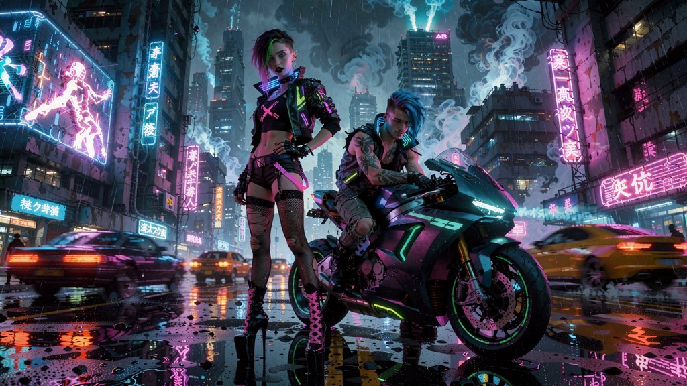
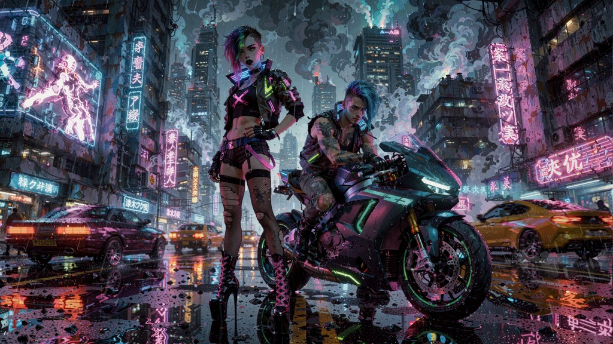
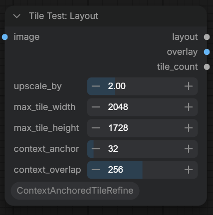
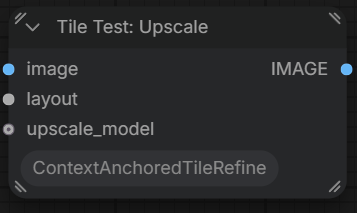
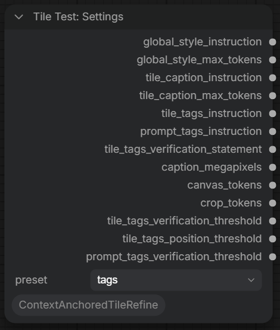
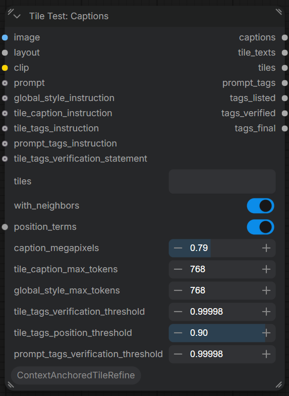
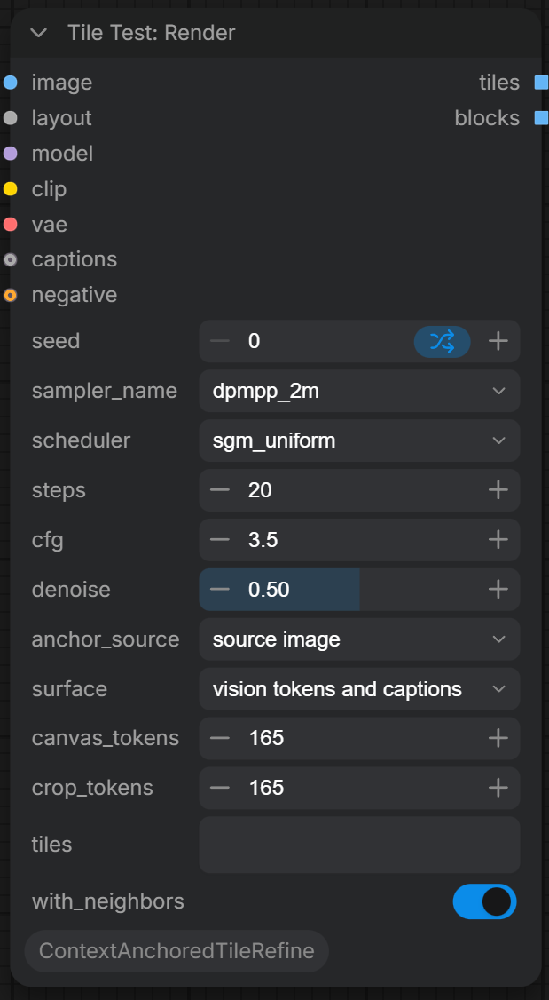

# Context-Anchored Tile Refine

ComfyUI nodes for tiled refining and upscaling. An already upscaled image is refined a tile at a time with no visible seams. On the VL nodes, a global prompt is replaced by vision conditioning.

Sample results from Krea 2 and the Tile Upscale (VL) node. Each image was upscaled in two passes. Click to view the full-sized image.

<table>
<tr>
<td align="center"><a href="samples/cyberpunks-couple.webp"></a><br><sub>v1.8.0, Original, 1024x576</sub></td>
<td align="center"><a href="samples/cyberpunks-couple-4k.webp"></a><br><sub>4x, denoise 0.35, 6 tiles, 4096x2304</sub></td>
<td align="center"><a href="samples/cyberpunks-couple-8k.webp"></a><br><sub>then 2x, denoise 0.35, 24 tiles, 8192x4608</sub></td>
</tr>
<tr>
<td align="center"><a href="samples/dark-city.webp"></a><br><sub>v1.8.0, Original, 1024x576</sub></td>
<td align="center"><a href="samples/dark-city-4k.webp"></a><br><sub>4x, denoise 0.35, 6 tiles, 4096x2304</sub></td>
<td align="center"><a href="samples/dark-city-8k.webp"></a><br><sub>then 2x, denoise 0.35, 24 tiles, 8192x4608</sub></td>
</tr>
<tr>
<td align="center"><a href="samples/cyberpunk-city.webp"></a><br><sub>v1.6.0, Original, 1024x576</sub></td>
<td align="center"><a href="samples/cyberpunk-city-4k.webp"></a><br><sub>4x, denoise 0.5, 6 tiles, 4096x2304</sub></td>
<td align="center"><a href="samples/cyberpunk-city-8k.webp"></a><br><sub>then 2x, denoise 0.35, 30 tiles, 8192x4608</sub></td>
</tr>
<tr>
<td align="center"><a href="samples/orbital-shipyard-hangar.webp"></a><br><sub>v1.6.0, Original, 1024x576</sub></td>
<td align="center"><a href="samples/orbital-shipyard-hangar-4k.webp"></a><br><sub>4x, denoise 0.5, 6 tiles, 4096x2304</sub></td>
<td align="center"><a href="samples/orbital-shipyard-hangar-8k.webp"></a><br><sub>then 2x, denoise 0.35, 30 tiles, 8192x4608</sub></td>
</tr>
</table>

## Contents

- [Installation](#installation)
- [The nodes](#the-nodes)
  - [Tile Refine](#tile-refine)
  - [VL nodes](#vl-nodes)
    - [Tile Refine (VL)](#tile-refine-vl)
    - [Tile Upscale (VL)](#tile-upscale-vl)
    - [Supported samplers](#supported-samplers)
- [Node Inputs and Parameters](#node-inputs-and-parameters)
- [Features](#features)
  - [Tiling geometry](#tiling-geometry)
  - [Seams on the base node](#seams-on-the-base-node)
  - [Seams on the VL nodes](#seams-on-the-vl-nodes)
  - [Conditioning on the VL nodes](#conditioning-on-the-vl-nodes)
  - [Regions, batches, and control](#regions-batches-and-control)
- [Settings file](#settings-file)
- [Test nodes](#test-nodes)
- [License](#license)

## Installation

Search for "Context-Anchored Tile Refine" in ComfyUI Manager, or clone into your `custom_nodes` folder:

```
git clone https://github.com/blakeem/ComfyUI-ContextAnchoredTileRefine
```

A clone also needs the one Python dependency, [logit-classifier](https://pypi.org/project/logit-classifier/). ComfyUI Manager installs it for you. After a clone, run this in ComfyUI's Python environment from the node's folder:

```
pip install -r requirements.txt
```

## The nodes

The example workflows linked below sit in the `workflows` folder, and ComfyUI lists them in its template browser. Some of them use third-party nodes.

### Tile Refine


The base node works with most diffusion models. Upscale the image first and feed it in. The sampling inputs are wired as for SamplerCustomAdvanced. Since the image is already upscaled, a mask is supported.

Example workflow: [Chroma + Z-Image hybrid](workflows/Chroma%20+%20z-image%20Hybrid%20workflow.json)

### VL nodes

The VL nodes were built for and tested with Krea 2. Other Qwen3-VL based models, including Krea 2 Turbo, are untested.

Both nodes take `clip`, `anchor_source`, `vlm_method` and `prompt`. Encoders without a vision path (SD/SDXL CLIP, T5, plain Qwen3) are rejected with a clear error. Connect the positive prompt's text to `prompt` so that each tile can confirm the things the prompt names (see [Tile tags](#tile-tags)).

#### Tile Refine (VL)


Tile Refine (VL) takes the same wiring as the base node. The guider's positive prompt is ignored, since each tile's conditioning is built from the image itself. Its negative still applies. A `mask` is supported and keeps the global view (see [Masked refine](#masked-refine)).

Example workflow: [Krea 2 refine](workflows/Krea%202%20%28refine%29.json)

#### Tile Upscale (VL)


Tile Upscale (VL) upscales and refines in one node. The image is upscaled first, through the optional `upscale_model` when connected, and a single lanczos pass brings it to `input size x upscale_by`. It then runs the same tile refine as Tile Refine (VL). Widgets replace the sampling inputs, and the optional `negative` still applies.

Example workflow: [Krea 2 8K upscale](workflows/Krea%202%208k%20upscale.json) (the two-pass 4x then 2x chain the v1.8.0 sample images were made with)

#### Supported samplers

The VL nodes step every tile against one schedule, so they must time each sampler's model evaluations. The supported samplers are `euler`, `heun`, `dpm_2`, `dpmpp_2m`, `dpmpp_2m_sde` (all variants), `exp_heun_2_x0`, and `exp_heun_2_x0_sde`. Anything else is rejected before sampling starts. `dpm_fast`, `dpm_adaptive`, and `uni_pc` run their own schedule and cannot be supported. The base node accepts every sampler.

## Node Inputs and Parameters

| Input | Nodes | What it does |
|---|---|---|
| [`max_tile_width` / `max_tile_height`](#dynamic-tile-layout) | all | Largest pixel size the model sees per tile, context rings included. Set to the largest size your model handles well. |
| [`context_anchor`](#context-rings) | all | Width of the context ring each tile conditions on. The ring holds neighboring tiles together and a masked region to its surroundings. |
| [`context_overlap`](#context-rings) | all | Width of the band neighboring tiles share. 0 gives hard seams. Smooth gradients need more and detailed scenes need less. |
| [`anchor_source`](#anchor-source) | VL | The context ring shows either the unmodified input for maximum fidelity, or the in-progress result so that flawed content can be repaired. |
| [`vlm_method`](#conditioning-on-the-vl-nodes) | VL | What the model is told about each tile. Adding captions repairs flawed content during upscale. |
| [`prompt`](#tile-tags) | VL | The prompt the image was made from. The VL model reads it to name each tile's contents, and the diffusion model never reads it. |
| [`mask`](#masked-refine) | Refine, Refine (VL) | Refines only the masked region and leaves everything outside it untouched. An inverted mask on a second pass refines the rest with other settings. |
| `clip` | VL | The vision-language encoder that builds all tile conditioning. Tested only with Qwen3-VL as used by Krea 2. |

Preview any layout with the [tile simulator](https://blakeem.github.io/ComfyUI-ContextAnchoredTileRefine/tile-simulator.html).

## Features

| Feature | Tile Refine | Tile Refine (VL) | Tile Upscale (VL) |
|---|:-:|:-:|:-:|
| [Dynamic tile layout](#dynamic-tile-layout) | ✓ | ✓ | ✓ |
| [Context rings](#context-rings) | ✓ | ✓ | ✓ |
| [Anchor conditioning](#anchor-conditioning) | ✓ | | |
| [Directional feather](#directional-feather) | ✓ | ✓ | ✓ |
| [Minimum error boundary cut](#minimum-error-boundary-cut) | ✓ | | |
| [Brightness and color match](#brightness-and-color-match) | ✓ | | |
| [Synchronized latent tiling](#synchronized-latent-tiling) | | ✓ | ✓ |
| [Anchor source](#anchor-source) | | ✓ | ✓ |
| [Vision tokens](#vision-tokens) | | ✓ | ✓ |
| [Captions](#captions) | | ✓ | ✓ |
| [Vision tokens and captions](#vision-tokens-and-captions) | | ✓ | ✓ |
| [Tile tags](#tile-tags) | | ✓ | ✓ |
| [Masked refine](#masked-refine) | ✓ | ✓ | |
| [Batches](#batches) | ✓ | ✓ | ✓ |
| [Guider input](#guider-and-controlnet) | ✓ | ✓ | |
| [ControlNet](#guider-and-controlnet) | ✓ | | |

### Tiling geometry

#### Dynamic tile layout

The grid is solved from the image size and `max_tile_width` / `max_tile_height`. Every crop is aligned to an 8 pixel boundary. Tiles are extracted, sampled, and pasted back at their native pixel size, so no quality is lost to resizing.

#### Context rings

Each tile is sampled with two extra rings that are cropped away after. `context_overlap` is the band shared with the neighboring tiles. `context_anchor` is pure context beyond that. The tile conditions on the anchor ring, so it continues its neighbors instead of drifting away from them. On the VL nodes, [`anchor_source`](#anchor-source) picks what the ring shows.

### Seams on the base node

The base node refines tiles one after another in raster order, so a tile's top and left neighbors are finished before it is sampled. Seams are hidden by conditioning first and then a narrow blend.

#### Anchor conditioning

The anchor ring shows each tile its already refined neighbors and holds that content frozen. This is the main seam mechanism, and the blending below only smooths the small differences left in the band.

#### Directional feather

Both tiles diffuse the shared band from the same raw pixels and the results are cross dissolved. The first 10 percent of the band stays with the new tile, then a squared ramp fades it to zero so that the two tiles connect at zero slope. A linear ramp meets the neighbor at an angle and appears as a visible line.

#### Minimum error boundary cut

Dynamic programming finds the path through the overlap band where the two refinements already agree, from Efros and Freeman, *Image Quilting for Texture Synthesis and Transfer* (SIGGRAPH 2001). The paper makes a hard cut on that path. With our method, the feather's midpoint bends along it, so the blend follows image content rather than a straight line.

#### Brightness and color match

Tiles diffused separately land at slightly different brightness and color levels. The fix is an additive, per channel, and sequential variant of gain compensation from Brown and Lowe, *Automatic Panoramic Image Stitching* (IJCV 2007). The shared band is the only place both tiles refined the same raw pixels, so the median of the difference there comes from the color shift and not from the content. Subtracting that median puts each tile on its neighbor's level. It runs only at tile seams, not at mask edges.

### Seams on the VL nodes

The VL nodes diffuse every tile together, so there is nothing to correct afterwards.

#### Synchronized latent tiling

The entire image is within one shared canvas latent and every tile is diffused one step at a time. Between steps the tiles are consolidated back into that canvas, with the overlap bands cross dissolved by the same [directional feather](#directional-feather) in latent space. This requires no boundary cut or color match.

MultiDiffusion (Bar-Tal et al., ICML 2023) and Mixture of Diffusers (Jiménez, 2023) also process tiles at every step. Those methods overlap tiles and use an average of the two predictions, so where the tiles disagree the result is a soft image. With our method, the tiles are joined together at the boundary so that the tile body is direct model output. Only the thin band is predicted twice, and the feather blends the seam toward the later tile. The anchor ring is context that the tiles use to be aware of their surroundings. Those methods fuse inside one sampler pass over the entire canvas. With ours, each tile runs its own sampler and all the tiles are held to the same step.

#### Anchor source

`source image` (default) shows the ring the unmodified input. This keeps placement, style, and objects locked to the input, including its flaws. The `live canvas` shows the ring the neighbors' in-progress result instead, so the refine can repair flawed content. Expect more invention and slightly brighter output.

### Conditioning on the VL nodes

A global prompt describes the entire image while each tile holds only part of it. The diffusion model then recreates prompt objects inside tiles that should not contain them. The VL nodes replace the prompt with conditioning that is true for each tile, built by the same Qwen3-VL encoder wired to `clip`. Two operations are involved. One encodes the image into vision tokens. The other writes a caption from the tile's own crop. `vlm_method` picks which ones fill each tile's conditioning.

#### Vision tokens

Each tile is assigned vision tokens from two encodes of the image. The tokens are loosely aware of their position and carry their area's tone, palette, and objects.

- **Crop tokens** come from an encode of the tile's own crop, sampled small. They hold the tile to what it contains, so an empty tile does not grow a copy of an object from elsewhere in the image.
- **Canvas tokens** come from one encode of the entire image. The tile is assigned its own slice of that grid, the tile plus its context rings. Those tokens carry the tile's place in the image and keep a person or a building at the right scale.

No global text prompt is used, so nothing phantom is introduced. The slicing selects tokens by region of interest, the analogue of RoIAlign (He et al., *Mask R-CNN*, ICCV 2017) in conditioning space. This is the fastest method, since one small encode per tile costs far less than one caption.

#### Captions

Each tile's text is used alone as that tile's prompt. The default preset writes the text as [tile tags](#tile-tags). A caption preset has the same VL model write a short description of each tile from that tile's crop alone (see [Presets](#presets)). Naming content removes ambiguity, so artifacts and mushy areas in the source are repaired toward the named thing. The cost scales with tile count and no vision encode is built. Tile texts are stored for the session, keyed by the crop and the preset, so a run at a new seed skips the text pass while the same CLIP stays loaded.

#### Vision tokens and captions

The default method combines the tile's vision tokens and its own text in a single conditioning. The vision tokens keep the tile faithful to the picture and at the right scale. The text names what is there and adds detail. The cost is one small encode plus one text pass per tile.

#### Tile tags

The default preset writes each tile's text as tags with their positions, such as `red car bottom-left`.

1. **List.** The VL model lists the things it sees in the tile. When `prompt` is connected, the VL model also lists the physical things the prompt names, once per image, and every tile checks them. A prompt in another language is translated to English first.
2. **Verify.** Each candidate is scored with a true or false statement on the tile, and only the tags with a near certain score are kept.
3. **Locate.** Six strips of the tile, three rows and three columns, give each tag its position, and a tag that no strip holds is dropped.

The scoring reads the VL model's answer probabilities through [logit-classifier](https://pypi.org/project/logit-classifier/). A long prompt adds one pass per image and never lengthens a tile's own listing.

### Regions, batches, and control

#### Masked refine

With a `mask`, the node crops to the masked region plus a `context_anchor` border, refines only that region against the frozen surrounding pixels, and composites it back with a 1px anti-aliased edge. The rest of the image is untouched. On the VL node the canvas tokens come from the full image, so the region is refined aware of its surroundings.

#### Batches

Each picture in a batch is refined on its own, so peak VRAM does not scale with batch size. Every picture gets its own conditioning, its own seam placement and color match on the base node, and its own synchronized run on the VL nodes.

#### Guider and ControlNet

The `guider` input takes any guider, including NAG for models without negative prompt support. ControlNet works on the base node. The control hint is cropped to each tile, so depth, canny, or pose guidance lands on the right pixels. The hint must be the same size as the input image. The VL nodes ignore ControlNet and log a warning, since every tile's positive is replaced by vision conditioning and there is nothing for a hint to attach to. GLIGEN, area masks, and reference latents pass through unchanged.

## Settings file

The VL nodes read their settings from `settings.toml` in the node's folder. Copy it to `settings.user.toml` and edit the copy. The nodes read `settings.user.toml` whenever it exists, and a node update never replaces it. The header of each settings file documents every key. The [Tile Test: Settings](#tile-test-settings) node shows the keys as its outputs.

- An edit applies on the next run, and the VL nodes re-run when the file changes even when no widget changed.
- The `vlm_method` options are built when ComfyUI starts, so adding, removing, renaming or moving a preset needs a restart.
- A mistake in the file stops the run with an error that names the file. If ComfyUI starts with the mistake, the nodes that read the file are missing from the menu and the console prints the reason.

### Vision table

The `[vision]` table sets how much of the image each tile's conditioning reads, for every `vlm_method` option.

- `canvas_tokens` is the number of [canvas tokens](#vision-tokens) each tile takes from the encode of the entire image.
- `crop_tokens` is the number of crop tokens from the encode of the tile's own crop.
- `caption_megapixels` is the size of the picture the VL model reads when it writes a tile caption or the style caption. A tags preset reads it for the style caption only.

Set one token count to 0 to turn that encode off.

### Presets

Each `[presets.<label>]` block adds one option per text method to `vlm_method`. The first block is the default, and its options carry no label. Every other block's options carry its label in parentheses. `settings.toml` ships one preset, `tags`. `settings.user.example.toml` carries presets that write captions instead, such as `prompted`, `standard` and `artwork`. Copy a block from it into your own `settings.user.toml` to use one.

- `tile_text` picks whether each tile's text is written as `tags` or as a `caption`.
- `tile_tags_instruction` and `prompt_tags_instruction` ask the VL model to list the things in the tile and the things the prompt names.
- The three threshold keys set the score a tag needs to be kept and to name its position.
- `tile_caption_instruction` is what the VL model is asked about each tile in a caption preset.
- `global_style_instruction` is asked about the entire image once per picture. The answer is placed on top of every tile's text so that all tiles follow one style description. Set it to `""` to skip the style caption.

An instruction may hold `{PROMPT}`. The VL nodes and the Tile Test: Captions node write their `prompt` input in its place before the VL model reads the instruction. A preset without `{PROMPT}` ignores the `prompt` input. The `tags` preset skips its prompt question when `prompt` is empty. Any other instruction with `{PROMPT}` stops the run with an error when `prompt` is not connected or is empty.

## Test nodes

Five test nodes ship for tuning tiles and presets. They are not production nodes. Tile Test: Layout, Upscale, Captions and Render chain in that order and run the engine the VL nodes run. Tile Test: Settings feeds one preset's values into the Captions node and the token counts into the Render node.

Example workflow: [Tile test chain](workflows/VL%208k%20upscale%20-%20Test.json)

### Tile Test: Layout



The Layout node solves the tile grid for the size the image has after `upscale_by`. Its overlay draws every tile's crop, overlap and core, labeled with the tile's number. The Captions and Render nodes take tiles by that number.

### Tile Test: Upscale



The Upscale node runs the upscale stage of Tile Upscale (VL) as a node of its own, so ComfyUI keeps the upscaled image cached. An image that is already upscaled skips it, with `upscale_by` at 1.0 on the Layout node.

### Tile Test: Settings



The Settings node outputs the values of one preset and the `[vision]` table, one output per key.

### Tile Test: Captions



The Captions node runs the caption or tags pass of the VL nodes on every tile, or only on the tiles you name, with or without their neighbors. Each instruction is a text input, so a trial wording wired from a text node needs no file edit. The text outputs show every stage of the tags pass for each tile. They are Markdown for the Markdown mode of Preview as Text, which needs Nodes 2.0 turned on.

### Tile Test: Render



The Render node refines the entire canvas, or only the tiles you name, with or without their neighbors. It holds the seed, so a new seed never upscales or captions the image again.

## License

[GPLv3](LICENSE)
